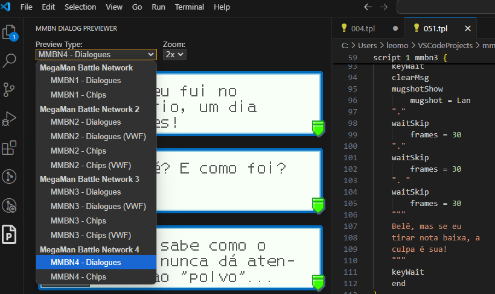

# mmbn-dialog-previewer

Essa é uma extensão do VSCode que permite pré-visualizar scripts dos jogos da série "MegaMan Battle Network", desde que eles estejam no formato TLP exportado pela ferramenta [TextPet](https://github.com/Prof9/TextPet), criada por Prof. 9.

Ela adiciona uma sidebar à esquerda, que quando ativa, exibe uma área que escuta eventos chamados quando um arquivo é editado no VSCode. Através desses eventos, desde que o usuário esteja editando scripts TLP exportados pelo TextPet, será exibida uma prévia de como o diálogo apareceria ingame.

A ferramenta foi feita pensando em vários jogos da série, tanto nas fontes originais como em fontes VWF customizadas oriundas de traduções PT-BR do MegaMan Battle Network 2 e 3. Também conta com diferentes modos de pré-visualização, seja de diálogos comuns ou de descrições de chips/subchips/PAs/etc.

# Como utilizar

Tendo os scripts em TLP de um dos jogos de MegaMan Battle Network dumpados pelo TextPet em mãos, baixe o arquivo "mmbn-dialog-previewer-0.0.1.vsix" e [instale-o manualmente no seu VSCode](https://code.visualstudio.com/docs/editor/extension-marketplace#_install-from-a-vsix).

Se feito corretamente, aparecerá um ícone de uma folha de papel com uma letra "P" ao centro, que quando clicado, mostrará as prévias dos diálogos em tempo real. A prévia considera a posição do cursor de texto, tenta determinar o diálogo que o cursor está, e por fim pega seus caracteres para exibir na prévia.

Também é possível alternar entre vários tipos de prévia, bem como zoom de até 3x:

Utilizando dessa prévia, é possível determinar quando um diálogo está próximo do limite da tela ou não, para poder ajustá-lo de acordo, sem precisar testar ingame.

# Como essa extensão foi desenvolvida?

Eu basicamente segui documentações como essa daqui que [ensina a criar uma extensão de "hello world" no VSCode](https://code.visualstudio.com/api/get-started/your-first-extension#developing-the-extension). Por essas instruções, consigo executar a extensão e debugá-la por breakpoints no processo.

Já na parte de compilar ela para arquivos .vsix, eu segui [essas instruções referentes a como publicar extensões](https://code.visualstudio.com/api/working-with-extensions/publishing-extension). Elas ensinam não só como compilar arquivos .vsix, como também como publicá-las no Marketplace do VSCode. No meu caso, por essa ser uma extensão bem específica e útil apenas para um caso de uso em comum, optei por distribuir o .vsix manualmente por aqui mesmo. Ao meu ver, seria mais válido estar no Marketplace se fosse uma solução mais genérica, mas como torná-la genérica daria um trabalhinho considerável, optei por fazer desta maneira.

# Disclaimer

Criei esta ferramenta para auxiliar em diversas iniciativas de fã-traduções de jogos da série MegaMan Battle Network para português brasileiro. Estou disponibilizando o código para quem se interessar. Sintam-se livres para utilizar do seu código à vontade, seja para adaptar para outros jogos ou para torná-la algo ainda maior do que atualmente é.